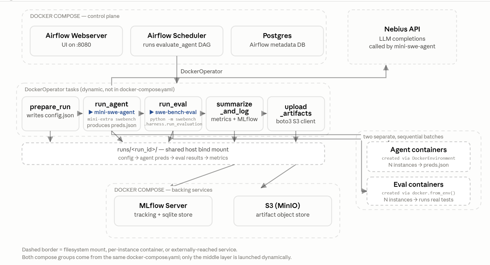
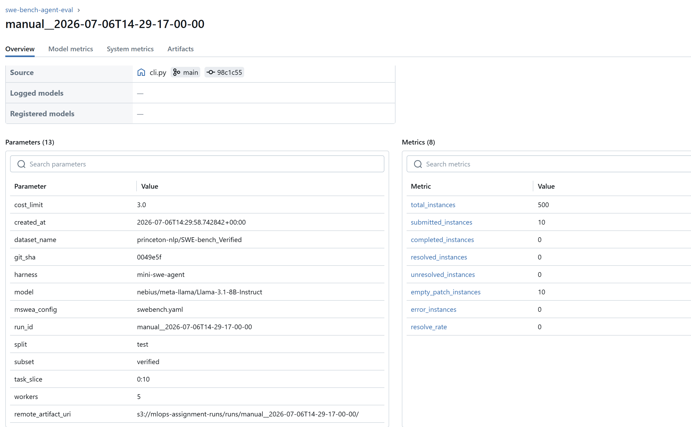
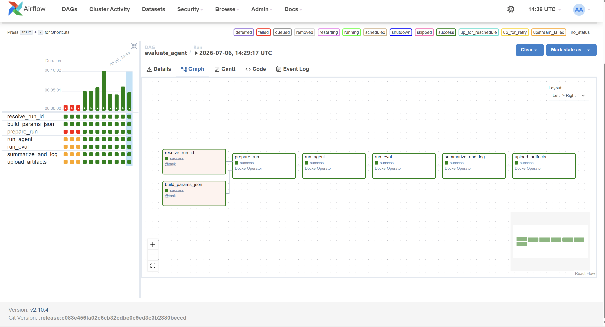
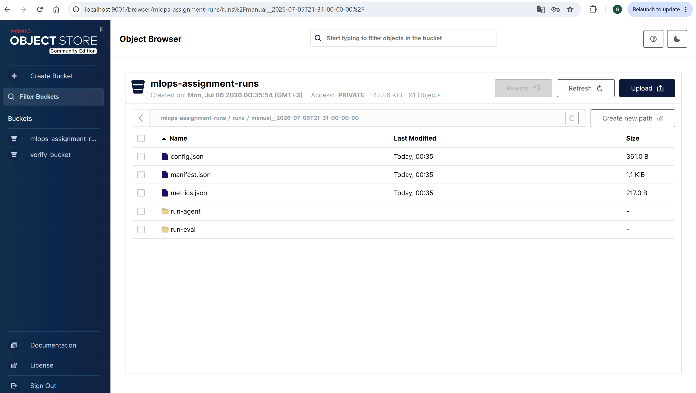

# REPORT

## Architecture

### Goal

Turn the ad-hoc `scripts/mini-swe-bench-batch.sh` -> `scripts/swe-bench-eval.sh` workflow into a
configurable Airflow DAG (`dags/evaluate_agent.py`) that runs `mini-swe-agent` on a slice of
SWE-bench, evaluates the resulting patches, writes a self-contained `runs/<run_id>/` folder, and
logs params/metrics to MLflow.



### Two environments, one repo

Airflow (`uv tool run apache-airflow standalone`, see `run-airflow-standalone.sh`, or the
`airflow-*` services in `docker-compose.yaml`) never has `mini-swe-agent`, `swebench`,
`mlflow`, or `boto3` installed — those live only inside the `pipeline` Docker image (built
from the project's own `Dockerfile` / `uv.lock`).

`dags/evaluate_agent.py` stays dependency-light: it imports only `airflow`, stdlib, and
`docker.types.Mount`. Every pipeline step (`prepare-run` / `run-agent` / `run-eval` /
`summarize` / `upload`) runs as its own **`DockerOperator`** task — a container built from
`Dockerfile`, whose `ENTRYPOINT` is `python -m pipeline.cli` — dispatching to
`pipeline/config.py`, `agents/`, `eval.py`, `metrics.py`, `mlflow_logging.py`, and
`upload.py` respectively (see the `pipeline/` package table below).

**Docker-outside-of-docker.** Each task container is a *sibling* of whatever process
Airflow itself runs in (a host process for `run-airflow-standalone.sh`, or the
`airflow-scheduler` container for `docker compose`), launched against the **host's**
Docker daemon via `/var/run/docker.sock` mounted into both the scheduler and every task
container — never nested. This matters for two reasons:

1. `run_eval` (the SWE-bench harness) and `run_agent` (`--environment-class docker`) each
   launch their *own* per-instance containers via `docker.from_env()`, so the pipeline
   container needs the same host daemon reachable, not an isolated Docker-in-Docker.
2. Bind-mount sources passed to `DockerOperator` have to be paths the **host** daemon can
   resolve, not paths as seen inside the scheduler's own container/venv. `HOST_PROJECT_ROOT`
   (set in `.env`, read by `dags/evaluate_agent.py`) carries that host path explicitly —
   `run-airflow-standalone.sh` sets it to `$(pwd)` since there Airflow *is* the host
   process; `docker-compose.yaml` requires it in `.env` since there it isn't.

`run_dir` is passed between tasks without decoding any JSON out of XCom: two cheap
non-Docker `@task`s (`resolve_run_id`, `build_params_json`) compute the run id and the
serialized Airflow params up front, and every `DockerOperator`'s `--run-dir` argument is
the single templated string `RUN_DIR_TEMPLATE = ".../runs/{{ ti.xcom_pull(task_ids='resolve_run_id') }}"`
— run_dir is a deterministic function of run_id (`pipeline.run_dir.run_dir_for`), so no
task needs to hand the next one anything more than that.

### Phase 3 deployment topology: `docker-compose.yaml`

```
docker compose network (COMPOSE_PROJECT_NAME_default)
┌───────────────────────────────────────────────────────────────────────┐
│  postgres            mlflow :5000            minio :9000 / :9001      │
│  (Airflow metadata,  (tracking server +      (S3-compatible store +   │
│   LocalExecutor)      artifact store)          web console)           │
│                                                                        │
│  airflow-webserver :8080        airflow-scheduler                     │
│                                       │                                │
│                                       │ DockerOperator, via bind-mounted│
│                                       │ /var/run/docker.sock (HOST     │
│                                       │ daemon - not nested/DinD)      │
│                                       ▼                                │
│                        sibling containers, same network, one per task:│
│                        prepare_run -> run_agent -> run_eval ->        │
│                        summarize_and_log -> upload_artifacts          │
│                        (image: mlops-assignment-pipeline:latest)      │
└───────────────────────────────────────────────────────────────────────┘
```

Every service above, plus every per-task sibling container `DockerOperator` launches,
joins the same compose network — that's how task containers reach `mlflow:5000` and
`minio:9000` by service name (`MLFLOW_TRACKING_URI`/`S3_ENDPOINT_URL` in
`docker-compose.yaml`'s `x-airflow-common` block) without any port-forwarding of their
own. `airflow-webserver`/`airflow-scheduler` are the only containers that also talk to
the **host's** Docker daemon (via the bind-mounted socket), which is what lets
`airflow-scheduler` create those sibling containers in the first place — see
"Docker-outside-of-docker" above. Ports published to the host: `8080` (Airflow UI),
`5000` (MLflow UI), `9000`/`9001` (MinIO API/console).

### DAG: `dags/evaluate_agent.py`

TaskFlow + classic-operator DAG, `dag_id="evaluate_agent"`, linear dependency chain:

```
[resolve_run_id, build_params_json] -> prepare_run -> run_agent -> run_eval -> summarize_and_log -> upload_artifacts
```

`resolve_run_id`/`build_params_json` are plain `@task` (no Docker); the other five are
`DockerOperator` tasks running the `pipeline` image.

Airflow params (all configurable from the UI, no hard-coded experiment values):

| Param | Default | Notes |
|---|---|---|
| `split` | `"test"` | SWE-bench dataset split |
| `subset` | `"verified"` | `lite` / `verified` / `full` |
| `workers` | `5` | parallel workers for both agent and eval |
| `harness` | `"mini-swe-agent"` | agent harness to run; `enum` mirrors `pipeline.agents.HARNESS_ADAPTERS` keys |
| `model` | `nebius/moonshotai/Kimi-K2.6` | LiteLLM model id |
| `task_slice` | `"0:3"` | instance slice, e.g. `0:3` |
| `run_id` | `""` | explicit run id; auto-generated from `dag_run.run_id` if blank |
| `cost_limit` | `3.0` | per-instance USD cost limit |

Retries and timeouts (`execution_timeout`/`retries`/`retry_delay` per task, chosen by failure mode):

| Task | Timeout | Retries | Retry delay | Why |
|---|---|---|---|---|
| `prepare_run` | 5 min | 0 | — | Pure local config write; a failure here is a real bug, not something a retry fixes. |
| `run_agent` | 4 h | 1 | 5 min | Transient infra (the cold-image-pull container-start timeout seen in the completed run below) is the expected failure mode. |
| `run_eval` | 2 h | 1 | 5 min | Same rationale — SWE-bench harness containers, same class of transient Docker start-up failures. |
| `summarize_and_log` | 15 min | 2 | 30 s | Expected failure mode is an MLflow network blip, not a logic error. |
| `upload_artifacts` | 15 min | 2 | 30 s | Same — S3/network blips, not logic errors. |

Because run_dir is passed via a single templated XCom string (see "Docker-outside-of-docker"
above) rather than a parsed JSON payload, these tasks don't need `do_xcom_push` at all
(`do_xcom_push=False`) — the run directory on disk stays the only source of truth.

### `pipeline/` package (runs inside the pipeline Docker image)

| Module | Responsibility |
|---|---|
| `config.py` | `build_run_config(params, fallback_run_id)` — resolves Airflow params into a full run config: sanitizes `run_id`, maps `subset` -> SWE-bench `dataset_name`, validates `harness` against `pipeline.agents.HARNESS_ADAPTERS`, captures the current git SHA, stamps `created_at`. |
| `run_dir.py` | Filesystem helpers: `prepare_run_dir()` creates `runs/<run_id>/{run-agent,run-eval}` and writes `config.json`; `read_json`/`write_json`/`write_manifest`/`update_manifest_remote_uri` helpers. |
| `agents/__init__.py` | Harness registry: `HARNESS_ADAPTERS` maps a harness name to its adapter's *module path* (a string, not an already-imported callable), and `run_agent_batch(run_config, run_dir)` lazily `importlib.import_module`s only the selected harness's module before delegating. Keeps harnesses isolated — a second adapter's broken/missing optional dependency can't break runs that select a different harness — and documents the adapter contract every harness module must satisfy (write `run-agent/preds.json` + `_result.json` in the standard shape) so adding one is additive: one new module + one registry entry, no changes anywhere else in `pipeline/` or the DAG. |
| `agents/mini_swe_agent.py` | The only adapter registered today. `run_agent_batch()` builds and runs `mini-extra swebench --subset --split --model --slice --workers --config --environment-class docker -o run-agent/`. `cost_limit` is passed as an inline `agent.cost_limit=<value>` config override (mini-swe-agent's `-c` flag supports `key=value` overrides merged on top of the base `swebench.yaml`). Writes `run-agent/_result.json`, `stdout.log`, `stderr.log`. |
| `eval.py` | `run_swebench_eval()` — runs `python -m swebench.harness.run_evaluation --dataset_name --split --predictions_path --max_workers --run_id` with `cwd=run-eval/`, so the harness's own output (the `<model>.<run_id>.json` summary and `logs/run_evaluation/...`) lands inside the run folder. Writes `run-eval/_result.json`. |
| `metrics.py` | `collect_metrics()` — parses the SWE-bench summary json into a flat dict (`resolved_instances`, `submitted_instances`, `resolve_rate`, ...). |
| `mlflow_logging.py` | `log_mlflow_run()` — logs the run config as MLflow params, the metrics dict as MLflow metrics, and `config.json`/`metrics.json`/the eval summary json as artifacts. `log_remote_artifact_uri()` re-opens that same run later to attach the S3 URI once `upload.py` has produced one. Uses `MLFLOW_TRACKING_URI`/`MLFLOW_EXPERIMENT_NAME` env vars; if unset, mlflow falls back to its own local default (tracking metadata in a `./mlflow.db` sqlite file, artifacts under `./mlruns/`) — in `docker compose` mode these point at the `mlflow` service instead. |
| `upload.py` | `upload_artifacts()` — uploads every file under `runs/<run_id>/` to `s3://$S3_BUCKET/runs/<run_id>/` via `boto3` (`S3_ENDPOINT_URL` makes this work against MinIO/Nebius Object Storage/real AWS S3 interchangeably), creating the bucket if it doesn't exist yet. Returns the resulting `remote_artifact_uri`. |
| `subprocess_utils.py` | `run_logged()` — shared "run a subprocess, persist its stdout/stderr next to the step's output" helper used by `agents/mini_swe_agent.py` and `eval.py` (each still decides for itself what counts as success). |
| `cli.py` | Dispatches `prepare-run` / `run-agent` / `run-eval` / `summarize` / `upload` subcommands. Every subcommand after `prepare-run` takes only `--run-dir`, reading whatever it needs from files already written into that directory — this is what lets the run folder be handed to someone else and fully understood without any external state. |

### Artifact layout produced per run

```
runs/<run_id>/
  config.json              # resolved params + dataset_name + git_sha + created_at
  run-agent/
    preds.json              # instance_id -> model_patch
    <instance_id>/<instance_id>.traj.json
    minisweagent.log
    exit_statuses_*.yaml
    _result.json             # {"preds_path", "trajectories_dir", "returncode"} - paths relative to run_dir
    stdout.log / stderr.log
  run-eval/
    <model>.<run_id>.json    # SWE-bench harness summary (resolved/unresolved/error counts)
    logs/run_evaluation/<run_id>/<model>/<instance_id>/{report.json, eval.sh, patch.diff, run_instance.log, test_output.txt}
    _result.json             # {"summary_path", "eval_dir", "returncode"} - paths relative to run_dir
    stdout.log / stderr.log
  metrics.json               # flat metrics parsed from the harness summary
  manifest.json              # pointers to every file above, relative to runs/<run_id>/
```

### `manifest.json`

Written last, by `summarize_and_log`, once everything else in the run folder exists.
`pipeline.run_dir.write_manifest()` records where the predictions, trajectories, agent log, eval
summary, eval logs, and metrics live, plus the run's `git_sha`, `created_at`, and the MLflow
run/experiment/tracking-URI/artifact-URI it was logged to. `agents/mini_swe_agent.py`/`eval.py` already record
their own outputs as paths relative to `run_dir` (e.g. `"run-agent/preds.json"`) rather than
absolute paths, so `write_manifest` just reshapes what's already there instead of re-deriving
relative paths later — the folder stays portable (copyable, uploadable) without any path
resolution happening at manifest-write time. It also carries a `remote_artifact_uri` field,
`null` until `upload_artifacts` runs and fills it in via `pipeline.run_dir.update_manifest_remote_uri()`.
The goal (per the README) is that this one file plus the folder it lives in is enough for
someone else to reconstruct the whole run without any other context.

### S3 upload (`upload_artifacts` task, `pipeline/upload.py`)

After `summarize_and_log`, `upload_artifacts` uploads every file under `runs/<run_id>/` to
`s3://$S3_BUCKET/runs/<run_id>/` via `boto3`, creating the bucket first if it doesn't exist.
`S3_ENDPOINT_URL` makes the same code path work against a local MinIO (the default —
`docker-compose.yaml` runs one), real AWS S3, or Nebius Object Storage — just point it (and
the credentials) at whichever one you want via `.env`. It then re-opens the MLflow run
(`log_remote_artifact_uri()`) to log `remote_artifact_uri` as a param, and rewrites
`manifest.json`'s `remote_artifact_uri` field to match, exactly as originally planned.

### Scope and known limitations

Phase 1 (configurable DAG), Phase 2 (durable `runs/<run_id>/manifest.json` + MLflow logging),
and Phase 3 (DockerOperator, docker-compose, retries/timeouts, S3 upload) are all implemented.
Remaining known gaps:

- **Airflow-triggered `evaluate_agent`, end to end via `docker compose`, now verified.**
  Two real environment issues turned up going from "container mechanics verified directly"
  to "Airflow itself schedules them", both on a Windows/Docker Desktop host (not WSL2/Linux,
  so not exactly the gotchas docs/TESTING.md anticipated for a Linux host):
  - **`DOCKER_GID` mismatch.** `airflow-scheduler`/`airflow-webserver` couldn't open the
    bind-mounted `/var/run/docker.sock` at all (`docker.errors.DockerException: Failed to
    establish connection to any given Docker hosts`) - Docker Desktop's socket is owned by
    a group GID the `.env.example` default (`999`) didn't match. Fixed by setting `.env`'s
    `DOCKER_GID` to the actual group ID (`ls -la /var/run/docker.sock` from inside the
    container, or `stat -c %g` on the host) and recreating the two containers.
  - **`HOST_PROJECT_ROOT` path format.** Once the socket was reachable, `DockerOperator`
    still failed creating the container: `invalid mount config for type "bind": bind
    source path does not exist`. `docker-compose.yaml`'s own `./dags:/opt/airflow/dags`
    mount works because the `docker compose` CLI (a native Windows binary here) resolves
    relative paths and translates them to a Windows path itself before calling the daemon.
    `dags/evaluate_agent.py`'s `Mount(source=...)` objects, built from `HOST_PROJECT_ROOT`
    by Python running *inside* the Linux scheduler container, get no such translation - they
    go straight to the Docker Engine API. On this host that API expects the bind source in
    native Windows form (confirmed via `docker inspect`'s recorded `Source` for the working
    `dags` mount: `D:\...\dags`, not a WSL2-style `/mnt/d/...` path). Fixed by setting
    `HOST_PROJECT_ROOT=D:/nebius-academy/.../mlops-assignment-e2e-ml-pipeline` (forward
    slashes, so `pathlib` inside the Linux container still parses/joins it correctly).
  With those two `.env` values corrected, `evaluate_agent` triggered from the Airflow UI ran
  all seven nodes (`resolve_run_id`, `build_params_json`, `prepare_run`, `run_agent`,
  `run_eval`, `summarize_and_log`, `upload_artifacts`) to success - see `screenshots/airflow_dag.png`.
  That exercise, plus the earlier direct-container-mechanics pass, caught and fixed the
  bugs below.
  - **Bug found and fixed:** the DAG originally bind-mounted the *whole* project root over
    `/mlops-assignment`, which shadowed the image's own baked `.venv` (from `uv sync
    --locked` at build time) with whatever `.venv` sits on the host - breaking `python`
    inside the container entirely. Fixed to mount only `runs/` (read-write) and `.git`
    (read-only, for `git_sha`) instead.
  - **Bug found and fixed:** `git` wasn't installed in the image at all, so `git_sha` would
    have silently come back `null` for every containerized run (`pipeline.config._git_sha()`
    swallows the exception). Added `git` to `Dockerfile` plus a `safe.directory` config
    entry (bind-mounted `.git` is owned by the host's UID, which git otherwise refuses).
  - **Bug found and fixed:** `upload_artifacts` uploaded `manifest.json` to S3 *before*
    `remote_artifact_uri` was filled in, so the remote copy permanently read `null` for the
    one field meant to point back at itself. Fixed by re-uploading just `manifest.json`
    after the local copy is patched (`upload_artifacts(..., only=["manifest.json"])`).
- **Agent harness is now a pluggable `harness` param, not hard-coded to mini-swe-agent** — the
  README frames agent quality as harness vs. model, but only `model` was a real experiment
  variable until `pipeline/agents/` (registry + adapter contract, see the package table above)
  and the DAG's `harness` param were added. `mini-swe-agent` is still the only registered
  adapter: it's the only one of the tools worth comparing (Claude Code, Codex, OpenCode, Cursor)
  that ships a built-in "run a slice of SWE-bench" batch command. Wiring up any of the others
  needs its own dataset-loading + per-instance-container + patch-extraction loop, which doesn't
  exist yet — this pass only built the extension point, not a second adapter.
- **`docker-compose.yaml` is intentionally minimal** — `LocalExecutor` + Postgres, no
  Celery/Redis/worker/triggerer; fine at this project's single-DAG, single-VM scale, not a
  template for multi-worker production Airflow.
- **No `KubernetesPodOperator`** — the README mentions it as the natural next step past
  `DockerOperator` at larger scale; out of scope here.
- The `cost_limit` param defaults to $3.00/instance as a safety cap; the reference
  `scripts/mini-swe-bench-batch.sh` ran unbounded, so results aren't directly comparable unless
  `cost_limit` is raised or the reference script's cost limit is otherwise matched.

## How to Trigger

(Full local dev setup, including WSL2/Docker gotchas, is in `docs/TESTING.md`.)

0. Build the pipeline image once (and after any change to `Dockerfile`/`pipeline/`):
   `docker build -t mlops-assignment-pipeline:latest .`
1. Start Airflow, either:
   - Easy mode: `bash run-airflow-standalone.sh` (sets `HOST_PROJECT_ROOT` for you), or
   - Production-style: `cp .env.example .env`, fill in `HOST_PROJECT_ROOT`/`DOCKER_GID`/
     `NEBIUS_API_KEY`, then `docker compose up -d`.
   Log in at http://localhost:8080 with `admin` / `admin`.
2. Open the `evaluate_agent` DAG, click the ▶ **Trigger** button, and supply a
   **Configuration JSON**, e.g.:
   ```json
   { "task_slice": "0:1", "workers": 1 }
   ```
   (or via CLI: `uv tool run apache-airflow dags trigger evaluate_agent --conf '{"task_slice":"0:1","workers":1}'`).
3. Watch `prepare_run -> run_agent -> run_eval -> summarize_and_log -> upload_artifacts` go
   green in order. On a red task, its **Logs** tab shows the container's stdout/stderr.

## MLflow

Easy mode (`run-airflow-standalone.sh`): local tracking, `MLFLOW_TRACKING_URI=sqlite:///mlflow.db`,
artifacts under `./mlruns/` (both gitignored). Production-style (`docker compose`): the `mlflow`
service (`http://mlflow:5000` from inside the compose network, `http://localhost:5000` from the
host), backed by its own sqlite db + artifact store inside the `mlflow-data` volume. Either way,
each `summarize_and_log` run logs the resolved run config as params, the
`metrics.json` fields as metrics, and `config.json`/`metrics.json`/the eval summary json as
artifacts.

Example logged run (from `manifest.json` of the completed production-style run below,
`run_id = manual__2026-07-05T21-41-19-00-00`):

| Field | Value |
|---|---|
| `mlflow_run_id` | `9f63e4dc1bc648b79d2af1a70750b317` |
| `mlflow_experiment_id` | `1` |
| `mlflow_tracking_uri` | `http://mlflow:5000` |
| `mlflow_artifact_uri` | `/mlflow/artifacts/1/9f63e4dc1bc648b79d2af1a70750b317/artifacts` |
| `remote_artifact_uri` | `s3://mlops-assignment-runs/runs/manual__2026-07-05T21-41-19-00-00/` |



## Completed Run

`run_id = manual__2026-07-05T21-41-19-00-00`, params: `split=test`,
`subset=verified` (`princeton-nlp/SWE-bench_Verified`), `task_slice=0:3`, `workers=5`,
`model=nebius/moonshotai/Kimi-K2.6`, `cost_limit=3.0` — triggered from the Airflow UI against
the `docker compose` stack (`postgres`/`mlflow`/`minio`/`airflow-scheduler`/`airflow-webserver`),
each DAG task its own `DockerOperator` sibling container.



All five `DockerOperator` tasks completed successfully (`run-agent/_result.json` and
`run-eval/_result.json` both `returncode: 0`), and `manifest.json` + `metrics.json` + the
MLflow run + the S3 (MinIO) upload were all written — confirming the full
`prepare_run -> run_agent -> run_eval -> summarize_and_log -> upload_artifacts` contract
works end to end, scheduled by Airflow itself (not just run as bare containers by hand).



None of the 3 evaluated instances (`astropy__astropy-12907`, `astropy__astropy-13236`,
`astropy__astropy-13033`) were resolved (`resolve_rate: 0.0`, `resolved_instances: 0/3`,
`empty_patch_instances: 3`). Root cause, per `run-agent/minisweagent.log`, is the same class
of issue seen in earlier Phase 1/2 runs: each instance's SWE-bench Docker container
(`sweb.eval.x86_64.astropy_*`) took longer than mini-swe-agent's 120s container-start
timeout to come up (cold image pulls), so the agent aborted every instance and emitted an
empty `model_patch`. This is an infra/timing issue in the agent run, not a pipeline bug —
every downstream step (eval harness, metrics parsing, manifest, MLflow logging, S3 upload)
correctly handled the empty-patch case and reported `unresolved`.

Earlier runs (`manual__2026-07-04T11-40-38.739301-00-00`, `manual__2026-07-04T10-49-09.819199-00-00`,
Phase 1/2, subprocess-based DAG) hit the identical failure mode on the same
`astropy__astropy-12907` instance, consistent with the SWE-bench image not yet being cached
locally in either environment.

## Rerun Instructions

- **Re-run the same experiment**: trigger `evaluate_agent` again with the same
  `Configuration JSON` used above (or omit `run_id` to auto-generate a new one from the
  Airflow `dag_run.run_id`). Since the SWE-bench image is now pulled locally, a retry is
  expected to clear the container-start timeout seen above.
- **Retry only a failed step** without redoing earlier work: in the Airflow UI, click the
  failed task -> **Clear** (also re-runs its downstream tasks). E.g. clearing `run_eval`
  reuses the existing `run-agent/preds.json` and only re-runs eval + summarize.
- **Reconstruct/inspect a past run** from disk alone: everything needed is under
  `runs/<run_id>/` — `config.json` for inputs, `manifest.json` for a pointer to every other
  file (predictions, trajectories, eval logs/reports, metrics, MLflow run/artifact URIs).
- **Inspect a run's MLflow record**: easy mode, `mlflow ui --backend-store-uri sqlite:///mlflow.db`;
  production-style (`docker compose`), open the `mlflow` service's own UI at
  `http://localhost:5000`. Either way, look up the run by the `mlflow_run_id` recorded in
  that run's `manifest.json`.
- **Inspect a run's uploaded artifacts**: production-style only — open the MinIO console at
  `http://localhost:9001` (`minioadmin`/`minioadmin`) and browse to
  `<bucket>/runs/<run_id>/`, or check `manifest.json`'s `remote_artifact_uri` field.
